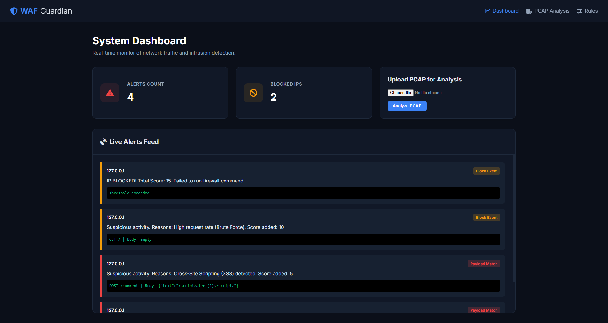
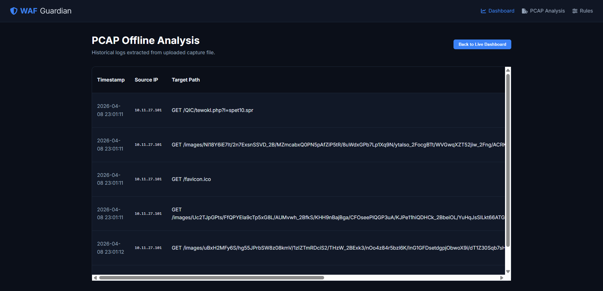
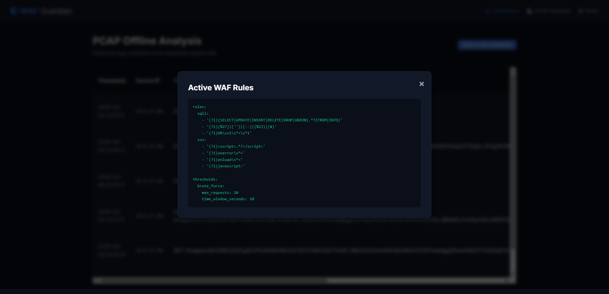
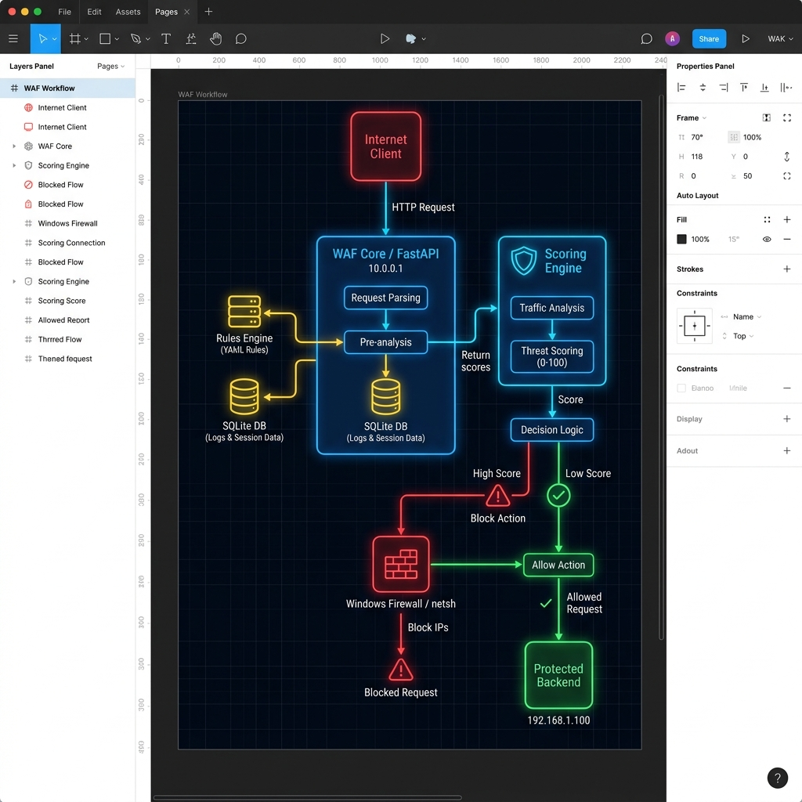

# WAFGuardian - SOC-Level Web Application Firewall

## 🚀 Project Overview

WAFGuardian is a production-ready, SOC-level Web Application Firewall (WAF) built entirely in Python. It serves as a reverse proxy that sits between internet clients and protected backend servers, intercepting and analyzing all HTTP traffic in real-time. The system employs a sophisticated rule-based scoring engine to detect and block malicious actors, featuring automated IP blocking via Windows Firewall integration.

### Key Features

- **🔍 Real-Time Threat Detection**: Advanced scoring engine detecting SQL Injection, XSS, and brute force attacks
- **🛡️ Automated IP Blocking**: Integrates with Windows Firewall for automatic threat mitigation
- **📊 SOC Dashboard**: Live WebSocket-based dashboard with real-time alerts and analytics
- **📧 Email Alerting**: SMTP-based notifications for critical security events
- **💾 Persistent Logging**: SQLite database for comprehensive threat history
- **🔬 Forensic Analysis**: Offline PCAP file analysis for incident response
- **⏰ Auto-Unblocking**: Temporary blocks with automatic expiration (15 minutes)
- **🌐 Reverse Proxy Architecture**: Inline inspection without backend modifications

## 📸 Quick Visual Overview

| SOC Dashboard | Real-Time Alerts | Threat Analytics |
|---------------|------------------|------------------|
|  |  |  |

**System Architecture & Workflow:**


## 🏗️ System Architecture

```
Internet Client
      │
      ▼
┌─────────────────────┐
│  WAFGuardian WAF    │  ← Port 8085
│  (Reverse Proxy)    │
│  FastAPI + httpx    │
│                     │
│ ┌─────────────────┐ │
│ │ Scoring Engine  │ │  ← analyzer.py
│ │ +5 SQLi         │ │
│ │ +5 XSS          │ │
│ │ +10 Brute Force │ │
│ └───────┬─────────┘ │
│         │ Score ≥ 10│
│ ┌───────▼─────────┐ │
│ │   IP Blocker    │ │  ← blocker.py (netsh)
│ └─────────────────┘ │
│ ┌─────────────────┐ │
│ │   SQLite DB     │ │  ← database.py
│ └─────────────────┘ │
│ ┌─────────────────┐ │
│ │  SMTP Mailer    │ │  ← mailer.py
│ └─────────────────┘ │
└─────────┬───────────┘
          │ (Clean traffic only)
          ▼
  Protected Backend Server
  (localhost:9000)
```

*For a detailed visual workflow, see the WAF Architecture Diagram below.*

## 📸 Screenshots & Visual Documentation

### SOC Dashboard - Main Interface
The primary dashboard showing real-time threat monitoring, system status, and analytics overview.


### Real-Time Alerts Panel
Live WebSocket-powered alerts display showing active threats, blocked IPs, and security events as they occur.


### Real-Time Alert Email
Live Email Alerts On Suspecious Activities.


### Threat Analytics Dashboard
Comprehensive analytics view with charts, statistics, and historical threat data for SOC analysis.


### System Status Overview
General system monitoring view showing WAF operational status and key metrics.


### WAF Architecture Diagram
Visual representation of the WAFGuardian system architecture and data flow.


## 🛠️ Technology Stack

- **Backend**: Python 3.8+, FastAPI, SQLAlchemy, SQLite
- **Network Analysis**: Scapy for packet capture and PCAP analysis
- **Frontend**: Vanilla HTML5, CSS3, JavaScript (ES6+)
- **Real-Time Communication**: WebSockets
- **Firewall Integration**: Windows `netsh` commands
- **Email**: SMTP (Gmail)
- **Configuration**: YAML-based rule engine

## 📁 Project Structure

```
WAFGuardian/
├── backend/
│   ├── app.py              # Main FastAPI application & reverse proxy
│   ├── analyzer.py         # Threat scoring engine
│   ├── blocker.py          # Windows Firewall integration
│   ├── database.py         # SQLite database operations
│   ├── mailer.py           # SMTP email alerting
│   ├── models.py           # SQLAlchemy ORM models
│   ├── rules.yaml          # Detection rules configuration
│   └── sniffer.py          # Network packet capture
├── frontend/
│   ├── index.html          # SOC dashboard UI
│   ├── css/
│   │   └── style.css       # Dark cyberpunk styling
│   └── js/
│       └── main.js         # WebSocket client & dashboard logic
├── tests/
│   └── test_attacks.py     # Automated security tests
├── Pics/                   # Project screenshots & diagrams
├── requirements.txt        # Python dependencies
├── implementation_plan.md  # Development roadmap
└── README.md              # This file
```

## 🚀 Quick Start

### Prerequisites

- Python 3.8 or higher
- Windows 10/11 (for `netsh` firewall integration)
- Administrator privileges (required for IP blocking)
- Npcap or WinPcap (for live packet capture)

### Installation

1. **Clone the repository**
   ```bash
   git clone https://github.com/sovandas089/WAF-IDS.git
   cd WAF-IDS
   ```

2. **Create virtual environment**
   ```bash
   python -m venv .venv
   .\.venv\Scripts\activate
   ```

3. **Install dependencies**
   ```bash
   pip install -r requirements.txt
   ```

4. **Configure email alerting** (optional)
   - Edit `backend/mailer.py` with your Gmail credentials
   - Enable "Less secure app access" or use App Passwords

### Running the Application

1. **Start the WAF server**
   ```bash
   # Run as Administrator for firewall blocking capabilities
   .\.venv\Scripts\python.exe -m backend.app
   ```

2. **Access the SOC Dashboard**
   - Open browser: `http://localhost:8085/dashboard`
   - View real-time alerts and analytics
   - Upload PCAP files for forensic analysis

3. **Configure protected backend**
   - Ensure your web application runs on `localhost:9000`
   - All traffic will be routed through WAFGuardian on port `8085`

## 🔧 Configuration

### Detection Rules

Edit `backend/rules.yaml` to customize threat detection:

```yaml
rules:
  sqli:
    - '(?i)(SELECT|UPDATE|INSERT|DELETE|DROP|UNION).*?(FROM|INTO)'
    - '(?i)(%27)|('')|(--)|(%23)|(#)'
  xss:
    - '(?i)<script>.*?</script>'
    - '(?i)onerror\s*='
thresholds:
  brute_force:
    max_requests: 20
    time_window_seconds: 10
```

### Scoring System

| Attack Type | Score | Block Threshold |
|-------------|-------|----------------|
| SQL Injection | +5   | ≥ 10 total |
| XSS | +5   | ≥ 10 total |
| Brute Force | +10  | ≥ 10 total |

## 🧪 Testing

Run the automated test suite:

```bash
.\.venv\Scripts\python.exe tests\test_attacks.py
```

Tests include:
- SQL Injection detection
- XSS payload blocking
- Brute force rate limiting

## 📊 API Endpoints

| Endpoint | Method | Description |
|----------|--------|-------------|
| `/dashboard` | GET | SOC dashboard UI |
| `/dashboard/api/rules` | GET | Current detection rules |
| `/dashboard/api/stats` | GET | Threat analytics data |
| `/dashboard/api/analyze_pcap` | POST | PCAP forensic analysis |
| `/dashboard/ws/alerts` | WS | Real-time alert stream |

## 🔒 Security Features

- **Multi-Factor Threat Scoring**: Prevents false positives
- **Temporary IP Blocks**: 15-minute auto-expiration
- **Comprehensive Logging**: Full audit trail in SQLite
- **Email Notifications**: SOC team alerting
- **Offline Analysis**: PCAP file processing
- **WebSocket Security**: Real-time dashboard updates

## 🤝 Contributing

1. Fork the repository
2. Create a feature branch
3. Make your changes
4. Add tests for new features
5. Submit a pull request

## 📝 License

This project is developed as part of academic coursework at OP Jindal University.

## 👨‍💻 Author

**Sovan Das** - BTL23CS08
- GitHub: [@sovandas089](https://github.com/sovandas089)
- Institution: OP Jindal University

## ⚠️ Important Notes

- **Administrator Privileges**: Required for Windows Firewall integration
- **Network Capture**: May require Npcap/WinPcap installation
- **Port Usage**: WAF runs on port 8085, backend should use 9000
- **Email Configuration**: Update SMTP settings in `mailer.py` for alerts

---

*Built with ❤️ for cybersecurity education and SOC operations*

